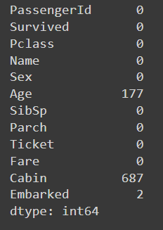
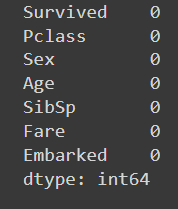
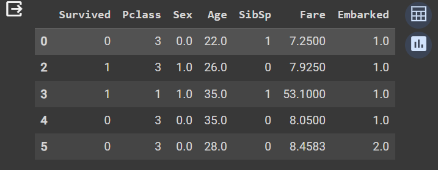
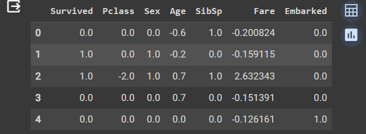
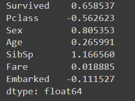
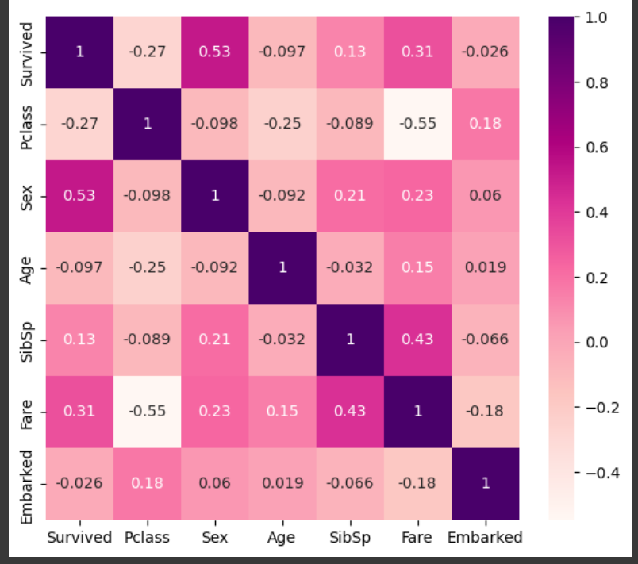
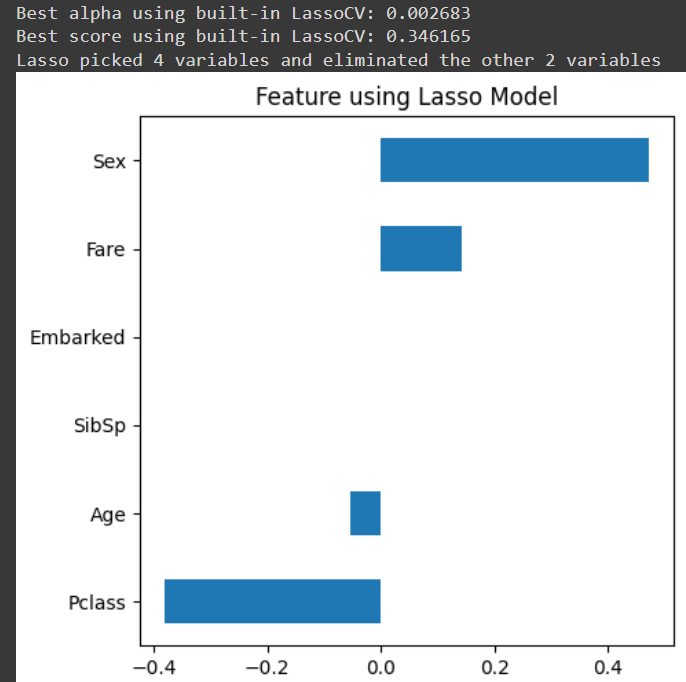

# Ex-07-Feature-Selection
## AIM
To Perform the various feature selection techniques on a dataset and save the data to a file. 

# Explanation
Feature selection is to find the best set of features that allows one to build useful models.
Selecting the best features helps the model to perform well. 

# ALGORITHM
### STEP 1
Read the given Data
### STEP 2
Clean the Data Set using Data Cleaning Process
### STEP 3
Apply Feature selection techniques to all the features of the data set
### STEP 4
Save the data to the file

# PROGRAM
```
import pandas as pd
import numpy as np
import matplotlib.pyplot as plt
df=pd.read_csv('/content/titanic_dataset.csv')
df.head()
df.isnull().sum()
df.drop('Cabin',axis=1,inplace=True)
df.drop('Name',axis=1,inplace=True)
df.drop('Ticket',axis=1,inplace=True)
df.drop('PassengerId',axis=1,inplace=True)
df.drop('Parch',axis=1,inplace=True)
df.head()
df['Age']=df['Age'].fillna(df['Age'].median())
df['Embarked']=df['Embarked'].fillna(df['Embarked'].mode()[0])
df.isnull().sum()
plt.title("Dataset with outliers")
df.boxplot()
plt.show()
cols = ['Age','SibSp','Fare']
Q1 = df[cols].quantile(0.25)
Q3 = df[cols].quantile(0.75)
IQR = Q3 - Q1
df = df[~((df[cols] < (Q1 - 1.5 * IQR)) |(df[cols] > (Q3 + 1.5 * IQR))).any(axis=1)]
plt.title("Dataset after removing outliers")
df.boxplot()
plt.show()
from sklearn.preprocessing import OrdinalEncoder
climate = ['C','S','Q']
en= OrdinalEncoder(categories = [climate])
df['Embarked']=en.fit_transform(df[["Embarked"]])
df.head()

from sklearn.preprocessing import OrdinalEncoder
climate = ['male','female']
en= OrdinalEncoder(categories = [climate])
df['Sex']=en.fit_transform(df[["Sex"]])
df.head()

from sklearn.preprocessing import RobustScaler
sc=RobustScaler()
df=pd.DataFrame(sc.fit_transform(df),columns=['Survived','Pclass','Sex','Age','SibSp','Fare','Embarked'])
df.head()

import statsmodels.api as sm
import numpy as np
import scipy.stats as stats
from sklearn.preprocessing import QuantileTransformer 
qt=QuantileTransformer(output_distribution='normal',n_quantiles=692)

df1=pd.DataFrame()
df1["Survived"]=np.sqrt(df["Survived"])
df1["Pclass"],parameters=stats.yeojohnson(df["Pclass"])
df1["Sex"]=np.sqrt(df["Sex"])
df1["Age"]=df["Age"]
df1["SibSp"],parameters=stats.yeojohnson(df["SibSp"])
df1["Fare"],parameters=stats.yeojohnson(df["Fare"])
df1["Embarked"]=df["Embarked"]
df1.skew()

import matplotlib
import seaborn as sns
import statsmodels.api as sm
%matplotlib inline
from sklearn.model_selection import train_test_split
from sklearn.linear_model import LinearRegression
from sklearn.feature_selection import RFE
from sklearn.linear_model import RidgeCV, LassoCV, Ridge, Lasso

X = df1.drop("Survived",1) 
y = df1["Survived"] 
plt.figure(figsize=(7,6))
cor = df1.corr()
sns.heatmap(cor, annot=True, cmap=plt.cm.RdPu)
plt.show()
cols = list(X.columns)
pmax = 1
while (len(cols)>0):
    p= []
    X_1 = X[cols]
    X_1 = sm.add_constant(X_1)
    model = sm.OLS(y,X_1).fit()
    p = pd.Series(model.pvalues.values[1:],index = cols)      
    pmax = max(p)
    feature_with_p_max = p.idxmax()
    if(pmax>0.05):
        cols.remove(feature_with_p_max)
    else:
        break
selected_features_BE = cols
print(selected_features_BE)
model = LinearRegression()

rfe = RFE(model,step= 4)

X_rfe = rfe.fit_transform(X,y)  

model.fit(X_rfe,y)
print(rfe.support_)
print(rfe.ranking_)

nof_list=np.arange(1,6)            
high_score=0
nof=0           
score_list =[]
for n in range(len(nof_list)):
    X_train, X_test, y_train, y_test = train_test_split(X,y, test_size = 0.3, random_state = 0)
    model = LinearRegression()
    rfe = RFE(model,step=nof_list[n])
    X_train_rfe = rfe.fit_transform(X_train,y_train)
    X_test_rfe = rfe.transform(X_test)
    model.fit(X_train_rfe,y_train)
    score = model.score(X_test_rfe,y_test)
    score_list.append(score)
    if(score>high_score):
        high_score = score
        nof = nof_list[n]
print("Optimum number of features: %d" %nof)
print("Score with %d features: %f" % (nof, high_score))

cols = list(X.columns)
model = LinearRegression()
rfe = RFE(model, step=2)             
X_rfe = rfe.fit_transform(X,y)  
model.fit(X_rfe,y)              
temp = pd.Series(rfe.support_,index = cols)
selected_features_rfe = temp[temp==True].index
print(selected_features_rfe)

reg = LassoCV()
reg.fit(X, y)
print("Best alpha using built-in LassoCV: %f" % reg.alpha_)
print("Best score using built-in LassoCV: %f" %reg.score(X,y))
coef = pd.Series(reg.coef_, index = X.columns)
print("Lasso picked " + str(sum(coef != 0)) + " variables and eliminated the other " +  str(sum(coef == 0)) + " variables")
imp_coef = coef.sort_values()
import matplotlib
matplotlib.rcParams['figure.figsize'] = (5.0, 5.0)
imp_coef.plot(kind = "barh")
plt.title("Feature importance using Lasso Model")
plt.show()
```
# OUTPUT

### DATA PREPROCESSING BEFORE FEATURE SELECTION:
<BR>
<BR>
<BR>
<BR>
<BR>
<BR>
<BR>
<BR>
<BR>
<BR>
### FEATURE SELECTION:
### HEATMAP:
<br>
### HIGHLY CORRELATED FEATURES WITH THE OUTPUT VARIABLE SURVIVED:

### BACKWARD ELIMINATION:

### RFE (RECURSIVE FEATURE ELIMINATION):

### OPTIMUM NUMBER OF FEATURES THAT HAVE HIGH ACCURACY:

### FINAL SET OF FEATURE:

### EMBEDDED METHOD:

# RESULT
Thus,various feature selection methods have been performed using the given dataset successfully.